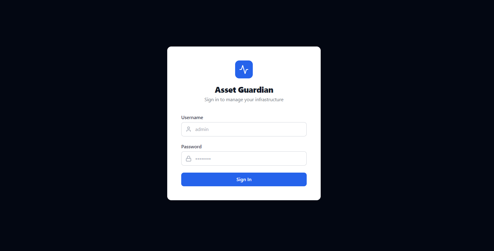
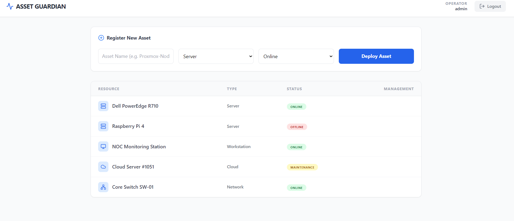

<div align="center">

# 🛡️ Asset Guardian - Home Lab & Infrastructure Inventory Manager

     

A full-stack IT asset inventory manager for tracking servers, workstations, network gear, and cloud instancesacross a home lab. Built to learn modern React patterns - engineered to the same standards as production internal tooling.

> **Context:** I already have projects covering CI/CD pipelines, Go load balancers, and Ansible automation. This project's goal was to go deep on the React ecosystem - hooks, context, component architecture, and how a real frontend codebase is structured.

---


## 📸 Screenshots

| Login                               | Dashboard                                   |
| ----------------------------------- | ------------------------------------------- |
|  |  |

---

</div>

## 🎯 What This Project Covers

This is specifically a **React learning project**. Every decision was made to practice a real pattern - not just to make the app work.

### Core React Concepts

| Concept              | Where it's applied                            | Why it matters                                                        |
| -------------------- | --------------------------------------------- | --------------------------------------------------------------------- |
| **Custom Hooks**     | `useAssets.js`, `useToast.js`                 | Extracts all logic from components - Dashboard is a pure view         |
| **Context API**      | `AuthContext.jsx`                             | Global auth state without prop drilling or a state library            |
| **useCallback**      | All hooks                                     | Prevents unnecessary re-renders on function identity changes          |
| **Code Splitting**   | `App.jsx` - `React.lazy` + `Suspense`         | Pages become separate JS chunks, loaded on demand                     |
| **Error Boundary**   | `ErrorBoundary.jsx`                           | Class component pattern - catches render crashes, shows recovery UI   |
| **Controlled Forms** | `Login.jsx` via `react-hook-form`             | Field-level vs auth-level errors, disabled submit while submitting    |
| **Protected Routes** | `ProtectedRoute` / `PublicRoute` in `App.jsx` | Auth-gated navigation, redirect-after-login pattern                   |
| **Service Layer**    | `src/api/`                                    | API calls isolated from components - Axios instance with interceptors |

### Production Engineering Applied

- **No `alert()` or `window.confirm()`** - replaced with a toast system and accessible modal dialog
- **Skeleton loaders** instead of raw loading text
- **Error banners** rendered in the UI, not just `console.error`
- **`sessionStorage`** for auth tokens - session dies when tab closes, safer than `localStorage`
- **Multi-stage Docker build** - Node compiles the app, Nginx serves it. Final image has zero Node.js
- **Non-root Nginx** - container never runs as root
- **Health checks** with `depends_on: service_healthy` - frontend waits for backend before starting
- **Chunk splitting** - `vendor` (React/DOM), `router`, `Dashboard`, `Login` all separate cached chunks
- **Security headers** - X-Frame-Options, X-Content-Type-Options, Referrer-Policy, Permissions-Policy

---

## 🏗️ Architecture

```text
src/
├── api/
│   ├── apiClient.js       # Axios instance - base URL, auth headers, 401/5xx handling
│   └── assets.js          # Asset service - one named method per endpoint
│
├── components/
│   ├── ConfirmDialog.jsx   # Accessible modal - replaces window.confirm()
│   ├── ErrorBoundary.jsx   # Class component - catches render crashes
│   └── ToastContainer.jsx  # Non-blocking notifications - replaces alert()
│
├── context/
│   └── AuthContext.jsx     # Login/logout/token - useCallback, sessionStorage
│
├── hooks/
│   ├── useAssets.js        # All CRUD logic - fetch, create, update, delete, edit mode
│   └── useToast.js         # Toast queue manager
│
└── pages/
    ├── Login.jsx            # Field errors + auth errors, autocomplete, PublicRoute
    └── Dashboard.jsx        # Zero API logic - pure view, consumes hooks only
```

**Key architectural rule:** Components never call the API directly. The flow is always:

```text
Component  →  Custom Hook  →  Service Layer  →  Axios Instance  →  API
```

---

## 🐳 Docker Setup

```text
Browser :9000
    │
    ▼
┌─────────────────────────────────────────┐
│            app-network (bridge)          │
│                                         │
│  frontend (Nginx:80)                    │
│  ├── serves compiled React app          │
│  └── /api/* proxied ──────────────────► │  backend (json-server:5000)
│                                         │  └── serves db.json over REST
└─────────────────────────────────────────┘
```

- Backend port `5000` is **never exposed** to the host - Nginx proxies `/api/` internally
- `VITE_*` env vars are baked into the JS bundle at build time via Docker `ARG`/`ENV`
- `db.json` is bind-mounted so data persists across container restarts

---

## 🚀 Quick Start

### Docker (recommended)

```bash
git clone https://github.com/yogeshT22/asset-guardian.git
cd asset-guardian

cp .env.example .env          # use defaults: admin/admin123, operator/operator123

docker compose up -d --build  # builds both images, starts with health checks

# Open http://localhost:9000
```

### Local Dev

```bash
npm install

# Terminal 1 - mock REST API
npx json-server --watch db.json --port 5000

# Terminal 2 - Vite dev server (proxies /api → localhost:5000)
npm run dev

# Open http://localhost:5173
```

---

## 🔑 Credentials

| Username   | Password      | Set via                            |
| ---------- | ------------- | ---------------------------------- |
| `admin`    | `admin123`    | `VITE_ADMIN_PASSWORD` in `.env`    |
| `operator` | `operator123` | `VITE_OPERATOR_PASSWORD` in `.env` |

> Auth is frontend-only simulation - intentional for a local homelab tool. The pattern (service layer, tokens, protected routes) mirrors real JWT auth; the only piece that would change in production is where the credential check happens (server-side, not client-side).

---

## 🛠️ Tech Stack

|            | Technology               | Notes                                               |
| ---------- | ------------------------ | --------------------------------------------------- |
| UI         | React 19, Tailwind CSS 3 |                                                     |
| Build      | Vite 7, Terser           | Manual chunk splitting, no source maps in prod      |
| Routing    | React Router v7          | Lazy-loaded routes, protected + public guards       |
| Forms      | React Hook Form          | Validation, error states, submit locking            |
| HTTP       | Axios                    | Centralized instance, request/response interceptors |
| Icons      | Lucide React             | Tree-shaken per icon                                |
| Mock API   | JSON Server              | REST over `db.json`                                 |
| Container  | Docker, Docker Compose   | Multi-stage build, health checks, resource limits   |
| Web Server | Nginx 1.27 Alpine        | Gzip, 1yr asset cache, security headers             |

---

## 📋 Scripts

```bash
npm run dev           # Vite dev server (localhost:5173)
npm run build         # Production build → dist/
npm run lint          # ESLint check
npm run lint:fix      # ESLint autofix
npm run docker:up     # docker compose up --build
npm run docker:down   # docker compose down
npm run docker:logs   # Follow container logs
```

---

## 📄 License

This project is licensed under the MIT License - see the LICENSE file for details.
